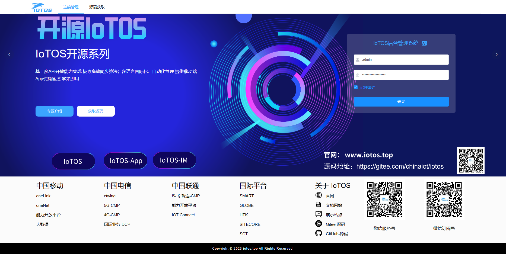
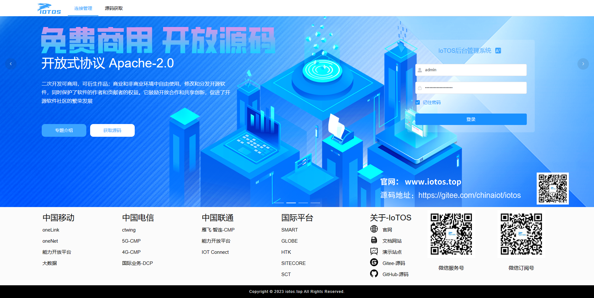
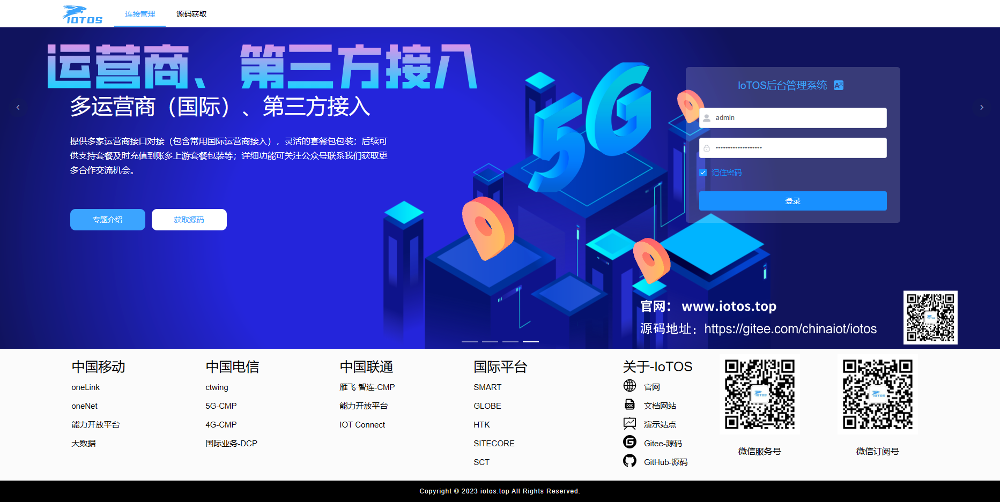
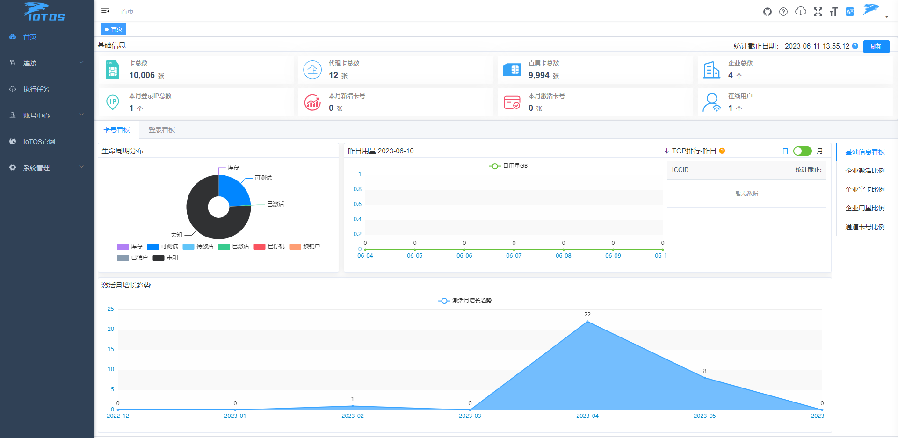
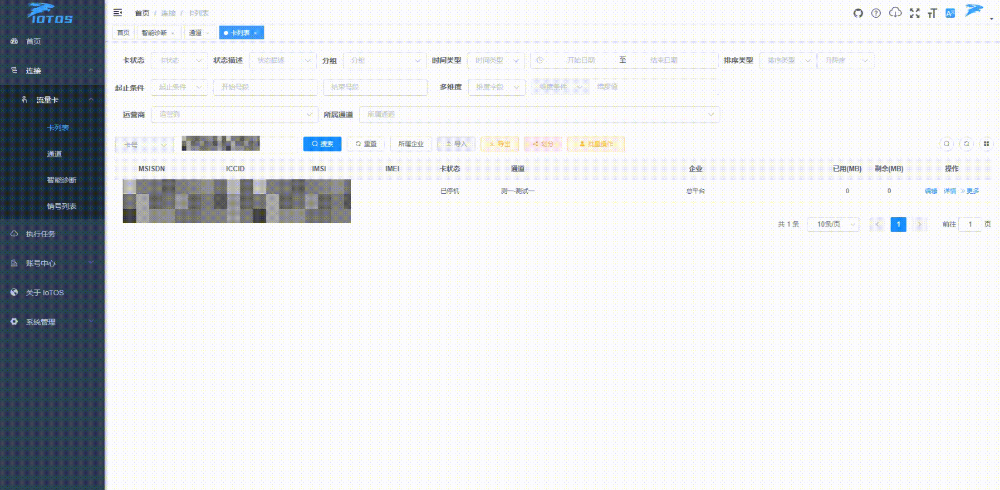
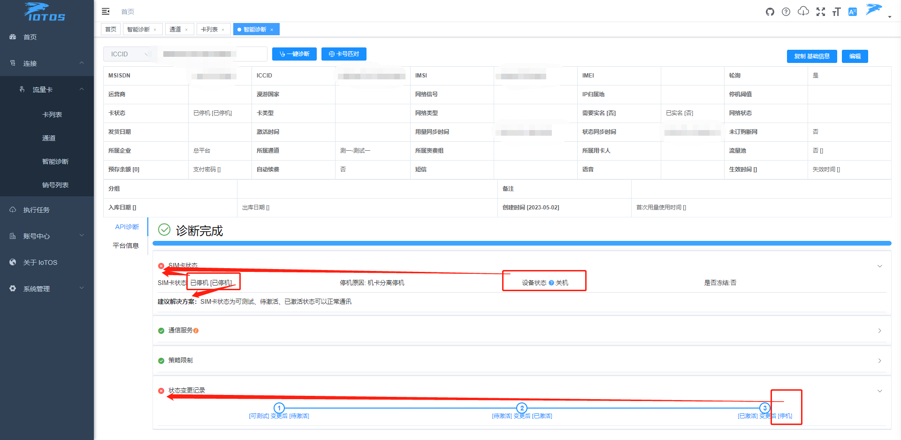
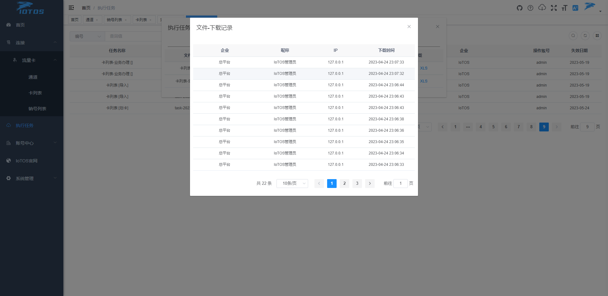

## IoTOS-Plus has been launched. The new "Far-neighbor" version is now available. Welcome to experience it.

> http://vip.iotos.top/register


# Introduction to PPT Appreciation


## Product background and positioning

## R&D background

## User & customer positioning


## Application scenarios


## Merchant and user application scenarios


## Economic benefits


## Trends in Economic Benefits of IoT Cards


## IoT card trend


## Physical Card System SWOT Analysis


## future business planning


## Future R&D investment


## Future product function planning


# IoTOS v1.6.3

## An efficient and practical IoTCard management & operation system.

> Integrated platform for IoT card operation; multi-interface capability integration, extreme synchronization algorithm, tens of millions of data carrying capacity, and international solutions. Multi-terminal system, direct charging and internal charging, built-in mall, package packaging, automatic management, pre-deposit and deduction


English / [中文](README.md)

<div class="shields-wrapper">
<a target="_blank" class="shields-wrapper-image" href='https://github.com/IoTCard/IoTOS'></a>
          <a target="_blank" class="shields-wrapper-image" href='https://github.com/IoTCard/IoTOS'></a>
          <a target="_blank" class="shields-wrapper-image" href='https://github.com/IoTCard/IoTOS'></a>
          <a target="_blank" class="shields-wrapper-image" href='https://gitee.com/chinaiot/iotos/stargazers'></a>
          <a target="_blank" class="shields-wrapper-image" href='https://gitee.com/chinaiot/iotos/members'></a>
</div>

# Related open source series

- [IoTOS](https://gitee.com/chinaiot/iotos) is developed based on [RuoYi-Vue](https://gitee.com/y_project/RuoYi-Vue?_from=gitee_search) for international multilingual use The IoTCard management business focuses on efficient, robust, and flexible design of SaaS, multilingual, robot push, automated management, and data synchronization multi-type algorithms.
- [IoTOS-App](https://gitee.com/chinaiot/iotos-app) developed based on [RuoYi-App](https://gitee.com/y_project/RuoYi-App?_from=gitee_search) Use [uView](https://gitee.com/umicro/uView) to optimize multilingual UI
- [IoTOS-IM](https://gitee.com/chinaiot/iotos-im) Based on [J-IM](https://gitee.com/xchao/j-im?_from=gitee_search) Extended Development**


# 1. About IoTOS

## 1.1 Introduction

IoTOS is an open source IoTCard (IoT card management) system based on SpringBoot, Vue, Mybatis, RabbitMq, Mysql, and Redis, and is a comprehensive solution for enterprise private domain management and operation.

Based on the open capabilities of multiple Internet of Things APIs (such as: China Mobile oneLink, etc.), IoTOS integrates upstream API data synchronization algorithms to provide international solutions.
Through multi-terminal system platform, extreme synchronization algorithm, system architecture business separation, flexible and efficient data operation module, enterprises can establish a strong link with the upstream;
Further diversify management and operations, improve the efficiency of IoT card operations, strengthen operational capabilities, and expand profitable space.

At present, it is mainly used in the Internet of Things communication service industry.

## 1.2 Capabilities

The whole system is temporarily divided into five modules:

* **Homepage**: statistical analysis panel;
* **Connection**: traffic card, equipment, channel operation management configuration view;
* **Account Center**: enterprise, user, role management and distribution authority account;
* **Automation**: automation management rules, templates, push configuration, trigger conditions, etc.;
* **System Management**: menu, parameters, dictionary, system monitoring, system tools, scheduled tasks, etc.;


## 1.3 Advantages

IoTOS is based on the open capability platform of the capability interface of multiple upstream operators, comprehensive business management and operation of IoT cards, but not limited to IoT cards, it can provide API docking management infrastructure for vertical scenarios such as IoT card operations, multiple third-party interface docking requirements, etc. The main advantages are:

* Multilingual international operation (UI interface, background reply, single user's favorite language), robot push (domestic mainstream robot, international mainstream social software)
* High-efficiency API synchronization capabilities use queue multi-thread instances to enable interface multi-threading (add java multi-threading to queue multi-threading) independent specific synchronization algorithm system based on different operator interfaces
* Automation rule definition, rule trigger template, notification configuration, trigger condition, etc.
* The open source protocol adopts Apache-2.0 (users can modify it freely for commercial use, there is no open source requirement)
* Adopt mainstream Java architecture, with high scalability and flexibility
* Provide internal API externally, low-cost secondary development

## 1.4 Vision

IoTOS is not an IoT expert, but allows every enterprise and developer to be its own IoT expert through open source:

* Integrate upstream multi-API basic capabilities, ready to use
* Provide one-stop service operation solutions for vertical industries
* Open up its own platform capabilities to allow more developers to participate
* Work with enterprises and developers to help the Internet of Things industry to build and develop the future

# 2. About the project

## 2.1 Online experience

### PC side

Open source demo address: [http://demo.iotos.top/](http://demo.iotos.top/)

Default account password: iotos, iotos.top

_(Note: The demo environment has blocked administrative rights and related operations)_

### Mobile-Android apk

[iotos-app_v0.6.0.apk in the 'apk' directory [Android version]](https://gitee.com/chinaiot/iotos-app/blob/master/apk/iotos-app_v0.6.0.apk)
[iotos-app_v0.1.0.apk in the 'apk' directory [Android version]](https://gitee.com/chinaiot/iotos-app/blob/master/apk/iotos-app_v0.1.0.apk)

### H5 web version

Open source demo address: [http://h5.iotos.top/](http://h5.iotos.top/)

Default account password: iotos, iotos.top


## 2.2 System Architecture

The overall system architecture of the IoTOS open source series is as follows IoTOSSystem23-08 design concept version:


## 2.3 Technology stack

This project is based on the background development framework of [RuoYi-Vue](https://gitee.com/y_project/RuoYi-Vue), thanks to the open source of [RuoYi-Vue](https://gitee.com/y_project/RuoYi-Vue) .

* Front-end technology stack: ES6, Vue, Vue-router, Vue-cli, Axios, Element-ui;
* Backend technology stack: Spring Boot, Mybatis-plus, Mybatis, RabbitMQ;

## 2.4 Project structure

**Backend structure**

```
├── iotos-admin // background service main program
├── iotos-common // Common component module
├── iotos-common-syn-ap // API request configuration center
├── iotos-consumer-admin // background main program - consumer
├── iotos-consumer-task // Timing task-consumer
├── iotos-framework // framework core
├── iotos-generator // code generation
├── iotos-quartz // Timing tasks
├── iotos-system // system code

```
**Front-end structure**

```
├── iotos-ui // front-end project
```

## 2.5 Project deployment

Click the link below to view the project deployment method:

[How to quickly deploy IoTOS](http://www.iotos.top/)

Recommended minimum server configuration:

| Type | Configuration |
|:-:|:-:|
|Operating System|CentOS8|
|CPU|4 core|
|Memory|8G|
|Bandwidth|5M|
|Hard disk|50G|

# 3. Frequently Asked Questions

Click the link below to enter the help manual to view the description of common problems and more help:

[FAQ](http://www.iotos.top/)

# 4. Recent update & follow-up development direction

## Subsequent development direction

- [ ] Perfect tutorials, in-depth explanations in the form of documents, videos and other data files Quick use, understanding of operations, secondary development and expansion, possible development directions, etc.
- [ ] The mobile terminal adapts to enterprise query, user binding, and also adapts to internationalization;
- [ ] OneLink EcV5 interface business continues to expand: `Smart Diagnosis` is defined as platform data diagnosis API interface diagnosis and more diagnosable item interfaces will be displayed according to different upstreams;
- [ ] `Automation` business module is well defined, including robot docking, etc.;
- [ ] `Payment configuration` Payment collection Domestic mainstream payment access, international payment access, etc.;
- [ ] `Package Definition` The package includes multiple types, multiple configurations, and multiple combinations;
- [ ] `Enterprise pre-deposit`, `User pre-deposit` Enterprise pre-deposit amount, order rebate, user top-up pre-deposit, independently set pre-paid deduction, etc.;
- [ ] `Recharge and Renewal` Business or user recharge, renewal, pre-deposit and other business extensions;
- [ ] `Central control analysis` includes but is not limited to analysis of enterprise and user recharge data (according to time, amount, transaction type, repurchase rate, activity, data synchronization success rate, transaction order time interval, package balance, etc.)
- [ ] `Mall` Release products Purchase order process, distribution, logistics


## V1.0.0 update log

- [x] Multilingual internationalization;
- [x] channels, card lists, usage records, basic services;
- [x] Card number automatic synchronization loading strategy;
- [x] API currently only supports OneLink EcV5 interface (will eventually rely on this interface as a comprehensive docking demonstration business, so stay tuned!);
- [x] OneLink EcV5 synchronization algorithm strategy queue multithreadingUse java multi-threaded matryoshka to significantly improve algorithm synchronization efficiency;
- [x] The usage and life cycle compensation algorithm is perfect;
- [x] Home page stats improved;

## V1.2.1 update log

- [x] Added a modifiable data carousel to the login page;
- [x] The login page adds the domestic commonly used operator platform website, the international platform operator website, and about-IoTOS link;
- [x] The login page adds platform capability descriptions, open protocol descriptions, and product series descriptions;
- [x] Added notifications for adapting the mobile terminal system to issue announcements through [IoTOS-IM](https://gitee.com/chinaiot/iotos-im) after logging in;
- [x] Optimize the default language of the login interface to 'Chinese';

## V1.5.3 update log

- [x] channel data statistics increase card number, total flow, used flow, remaining flow statistics;
- [x] Add session information query session records (paging query) and export history records for card details;
- [x] Newly added intelligent diagnosis card status, freezing status, downtime reason, regional restriction status, regional restriction area, device status, business change history, APN query already opened, diagnosis suggestion prompt; (perfect restoration of OneLink smart diagnosis);
- [x] Optimize the card number synchronization algorithm bug;
- [x] Optimize card number comparison, add card number algorithm timing task trigger interval, etc.;
- [x] Optimize the regular cleaning of the upstream synchronization card number cache (to ensure that the new card number is updated when the upstream card number changes or the canceled card number is no longer synchronized);

## V1.6.3 update log

- [x] Added batch business processing and added text field batch card number entry;
- [x] Fix language encoding format parsing issues;
- [x] Fix the problem of wrong delivery time modification;
- [x] Optimize the intelligent diagnosis status and time display problem;

# 5. Contact us

If you want to join our open source communication group, have any ideas, opinions or suggestions on IoTOS products, or business cooperation needs, please scan the QR code to add IoTOS project authors and join the group chat:

- WeChat


- WeChat public account


# 6. Donation support

If you are a business owner and have plans to use `IoTOS` in your company's business products, long-term donations are welcome. The business benefits of long-term donations are:

* Positive response, fast maintenance and timely update;
* The company name, logo and official website link will be displayed in the open source warehouse, `IoTOS` official website and publicity materials for a long time;
* The donation amount will be deducted from the price of paid products of `IoTOS` in the same proportion.

If you are interested in sponsoring the `IoTOS` team for a long time, or have other good ideas, please contact the development team on WeChat `iotos_top`, or send an email to `card@iotos.top`.

# Seven, project display

## Log in








## front page



## aisle


## card list


## Intelligent diagnosis gif





## Session log export


## Card number details


## Business handling


## Execute the task


## execute task-file


## Execute task-file-download record



## Divide the recall


## Internationalization languages


## About IoTOS


# mobile terminal

## login page


## Workbench


## mine


## Language switching


## Login announcements and notifications


## Card information query


## session record


## Intelligent diagnosis


## usage record


## Business handling


## Notification message

> View Changelog page


## Notification message

> Not implemented yet, only improved single-interface ui


**<p align="center">If you find our open source project helpful, please click :star: Star Support IoTOS :heart:</p>**