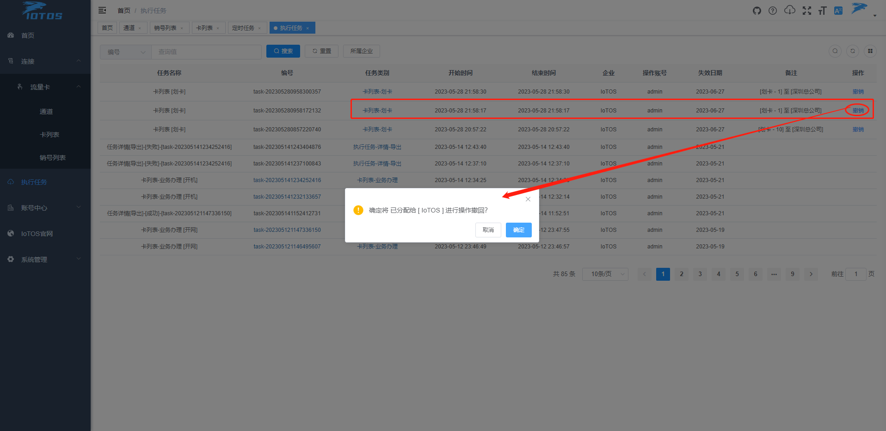
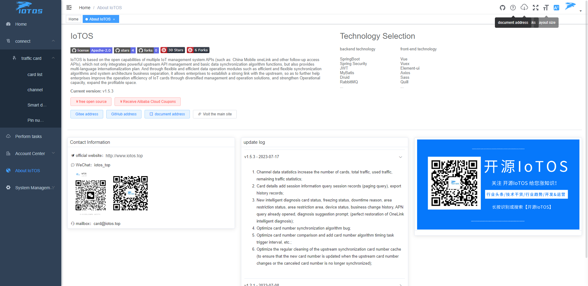

<p></p>


# IoTOS v1.0.0

## An efficient and practical IoTCard management & operation system.

> IoTOS is currently named too broadly, and it is mainly used for IoTCard management business with efficient, robust, and flexible design of SaaS, multi-language, robot push, automatic management, and data synchronization multi-type algorithms as the main business.


Chinese / [English](README.en.md)

<div class="shields-wrapper">
<a target="_blank" class="shields-wrapper-image" href='https://github.com/IoTCard/IoTOS'></a>
           <a target="_blank" class="shields-wrapper-image" href='https://github.com/IoTCard/IoTOS'></a>
           <a target="_blank" class="shields-wrapper-image" href='https://github.com/IoTCard/IoTOS'></a>
           <a target="_blank" class="shields-wrapper-image" href='https://gitee.com/chinaiot/iotos/stargazers'></a>
           <a target="_blank" class="shields-wrapper-image" href='https://gitee.com/chinaiot/iotos/members'></a>
</div>


# 1. About IoTOS

## 1.1 Introduction

IoTOS is an open source IoTCard (IoT card management) system based on SpringBoot, Vue, Mybatis, RabbitMq, Mysql, and Redis. It is a comprehensive solution for enterprise private domain management and operation.

Based on the open capabilities of multiple IoT management system APIs (such as China Mobile oneLink and other subsequent access APIs), IoTOS not only integrates powerful upstream API management and basic data synchronization algorithm functions, but also provides multi-language internationalization solutions. And through flexible and efficient data operation modules such as efficient and flexible synchronization algorithms and system architecture business separation, a strong link between the enterprise and the upstream can be established, so as to further help enterprises improve the operational efficiency of the Internet of Things card through diversified management and operation solutions, and strengthen Operational capacity, and expand the profitability of the department.

At present, it is mainly used in the field of IoT card service industry.

## 1.2 Capabilities

IoTOS-IoTCard is based on the comprehensive business management of multiple upstream API interfaces of the Internet of Things, follows the process of efficient data synchronization and maintenance operation, then establishes system package distribution for tariff marketing, and finally creates value again in the process of marketing, operation and other service provision.


The whole system is temporarily divided into five modules:

* **Homepage**: statistical analysis panel;
* **Connection**: traffic card, equipment, channel operation management configuration view;
* **Account Center**: enterprise, user, role management and distribution authority account;
* **Automation**: automation management rules, templates, push configuration, trigger conditions, etc.;
* **System Management**: menu, parameters, dictionary, system monitoring, system tools, scheduled tasks, etc.;

Interested developers, business cooperation, business discussions, etc. are welcome to contact through the contact information below

## 1.3 Advantages

IoTOS is based on the open capability platform of the capability interface of multiple upstream operators, comprehensive business management and operation of IoT cards, but not limited to IoT cards, it can provide API docking management infrastructure for vertical scenarios such as IoT card operations, multiple third-party interface docking requirements, etc. The main advantages are:

* Multilingual international operation (UI interface, background reply, single user's favorite language), robot push (domestic mainstream robot, international mainstream social software)
* Efficient API synchronization capability uses queue multi-thread instances to enable interface multi-threading (add java multi-threading to queue multi-threading) and has independent specific synchronization algorithm system for different operator interfaces
* Automation rule definition, rule trigger template, notification configuration, trigger condition, etc.
* The open source protocol adopts Apache-2.0 (users can modify it freely for commercial use, there is no open source requirement)
* Adopt mainstream Java architecture, with high scalability and flexibility
* Provide internal API externally, low-cost secondary development

## 1.4 Vision

IoTOS is not an IoT expert, but allows every enterprise and developer to be its own IoT expert through open source:

* Integrate upstream multi-API basic capabilities, ready to use
* Provide one-stop service operation solutions for vertical industries
* Open up its own platform capabilities to allow more developers to participate
* Work with enterprises and developers to help the Internet of Things industry to build and develop the future

# 2. About the project

## 2.1 Online experience

Open source demo address: [http://demo.iotos.top/](http://demo.iotos.top/)

Default account password: iotos, iotos.top

_(Note: The demo environment has blocked administrative rights and related operations)_

## 2.2 System Architecture

The overall system architecture of IoTOS V1.0.0 is as follows:

## 2.3 Technology stack

This project is based on the background development framework of [RuoYi-Vue](https://gitee.com/y_project/RuoYi-Vue), thanks to the open source of [RuoYi-Vue](https://gitee.com/y_project/RuoYi-Vue) .

* Front-end technology stack: ES6, Vue, Vue-router, Vue-cli, Axios, Element-ui;
* Backend technology stack: Spring Boot, Mybatis-plus, Mybatis, RabbitMQ;

## 2.4 Project structure

**Backend structure**

```
├── iotos-admin // background service main program
├── iotos-common // Common component module
├── iotos-common-syn-ap // API request configuration center
├── iotos-consumer-admin // background main program - consumer
├── iotos-consumer-task // Timing task-consumer
├── iotos-framework // framework core
├── iotos-generator // code generation
├── iotos-quartz // Timing tasks
├── iotos-system // system code

```
**Front-end structure**

```
├── iotos-ui // background project
```

## 2.5 Project deployment

Click the link below to view the project deployment method:

[How to quickly deploy IoTOS](http://www.iotos.top/)

Recommended minimum server configuration:

| Type | Configuration |
|:-:|:-:|
|Operating System|CentOS8|
|CPU|4 core|
|Memory|8G|
|Bandwidth|5M|
|Hard disk|50G|

# 3. Frequently Asked Questions

Click the link below to enter the help manual to view the description of common problems and more help:

[FAQ](http://www.iotos.top/)

# 4. Recent update & follow-up development direction

## Subsequent development direction

- [ ] Perfect tutorials, in-depth explanations in the form of documents, videos and other data files Quick use, understanding of operations, secondary development and expansion, possible development directions, etc.
- [ ] The mobile terminal adapts to enterprise query, user binding, and also adapts to internationalization;
- [ ] OneLink EcV5 interface business continues to expand: `Smart Diagnosis` is defined as platform data diagnosis API interface diagnosis and more different upstreams will display more diagnosable item interfaces, etc.;
- [ ] `Automation` business module is well defined, including robot docking, etc.;
- [ ] `Payment configuration` Payment collection Domestic mainstream payment access, international payment access, etc.;
- [ ] `Package Definition` The package includes multiple types, multiple configurations, and multiple combinations;
- [ ] `Enterprise pre-deposit`, `User pre-deposit` Enterprise pre-deposit amount, order rebate, user top-up pre-deposit, independently set pre-paid deduction, etc.;
- [ ] `Recharge and Renewal` Business or user recharge, renewal, pre-deposit and other business extensions;
- [ ] `Central control analysis` includes but is not limited to analysis of enterprise and user recharge data (according to time, amount, transaction type, repurchase rate, activity, data synchronization success rate, transaction order time interval, package balance, etc.)
- [ ] `Mall` Release products Purchase order process, distribution, logistics


## V1.0.0 update log

- [x] Multilingual internationalization;
- [x] channels, card lists, usage records, basic services;
- [x] Card number automatic synchronization loading strategy;
- [x] API currently only supports OneLink EcV5 interface (will eventually rely on this interface as a comprehensive docking demonstration business, so stay tuned!);
- [x] OneLink EcV5 synchronization algorithm strategy Using java multi-thread nesting dolls in queue multi-threading significantly improves algorithm synchronization efficiency;
- [x] The usage and life cycle compensation algorithm is perfect;
- [x] Home page stats improved;


# 5. Contact us

If you want to join our open source exchange group, have any ideas, opinions or suggestions on IoTOS products, or business cooperation needs, please scan the QR code to add IoTOS project authors and join the group chat:

- WeChat


- WeChat public account


# 6. Donation support

If you are a business owner and have plans to use `IoTOS` in your company's business products, long-term donations are welcome. The business benefits of long-term donations are:

* Positive response, fast maintenance and timely update;
* The company name, logo and official website link will be displayed in the open source warehouse, `IoTOS` official website and publicity materials for a long time;
* The donation amount will be deducted from the price of paid products of `IoTOS` in the same proportion.

If you are interested in long-term sponsorship of the `IoTOS` team, or have other good ideas, please contact the development team on WeChat `iotos_top`, or send an email to `card@iotos.top`.

# Seven, project display








**<p align="center">If you find our open source project helpful, please click :star: Star Support IoTOS :heart:</p>**